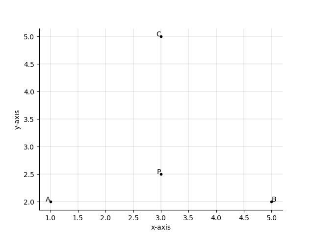
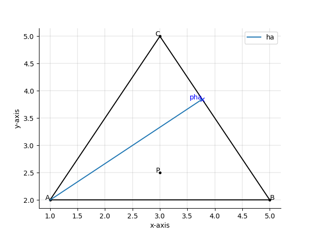

# 2019-end-member-mixing-model
### Python 3.7.2, JetBrains PyCharm Community Edition 2018.3.5
This project is part of my master thesis “Abflussseparation mittels stabiler Isotopen - Bestimmung der Wasserherkunft nach Regen, Schnee- und Gletscherschmelze in drei alpinen Einzugsgebieten” (hydrological separation with stable isotopes- determination of the water origin into rain, snow- and glacier melt in three alpine catchments). The master thesis is embedded in a research project of the hydropower company Kraftwerke Oberhasli AG and the University of Bern.
Further information about the background of the script is available in the **Report_ EMMA.pdf**.
Author: Noemi Buri, noemi.buri@students.unibe.ch, University of Bern, Seminar Geodata analysis and modelling 2019

## Goal
The goal of this script is to control a set of data on its suitability for doing an end-member-mixing-analysis (EMMA). Therefore, the mixing triangle is shown, and the user can check, if the investigated sample is within the triangle. If this is the case the percentual amount of the three different water origins is given. Further information about the EMMA is given in the Report_EMMA.pdf. Vector calculations are used to solve the EMMA.

## Workflow
In the following part the workflow of the script is described.
### 1. import
Firstly, the packages numpy, math, sympy and matholpot.lib.pyplot are installed.
### 2. read data from user
Here the user is getting asked for his import data. For each of the three components a two-dimensional vector is created. For the component A the user is asked for Ax and Ay out of which the vector A is built. The same information for the components B and C is asked. Out of this data the corners of the mixing triangle are set. Further the data of the investigated sample on which the mixing calculation is done needs to be declared. The vector of this sample is named P. In *figure 1* you can see a visualization of this step of the project.

*figure 1 : components A, B and C and mixing sample P*

If you feel more comfortable to import your data with a csv-file you can use the following code:

x=np.loadtxt(r"C:\--insert file path --\test.csv", skiprows=1, dtype=float, delimiter=";")

a=x[0,:]

b=x[1,:]

c=x[2,:]

p=x[3,:]

### 3. define triangle
In this section the mixing triangle gets defined. Therefore, the vector direction and magnitude of the triangle sides are calculated. The vector sides are named AB, BC and CA. For each triangle side the triangle height is assessed. Here as well the vector direction and magnitude are calculated. Whereas the triangle lengths are called ha, hb and hc. The point where the triangle height meets the opposite triangle side is called pha for the component A, phb for the componente B and phc for the component C. The vector direction of the triangle sides are named phaA, phbB and phcC. In *figure 2* you can see this step of the calculations for the component A.

*figure 1 : components A, B and C and mixing sample P*
### 4. triangle calculations

### 5. plot

## Output

